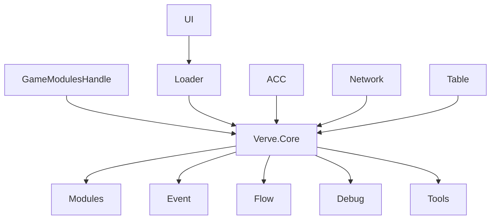

# Verve.Core

> `Verve.Core` 是框架的运行时基础层：提供模块容器、生命周期、事件、异步流程、调试入口、游戏循环和无状态工具。

## 核心功能

| 功能     | 基础描述                                                       | 主要类型                                           | 文档                                      |
| -------- | -------------------------------------------------------------- | -------------------------------------------------- | ----------------------------------------- |
| 模块容器 | 创建、安装、查询和释放运行时模块，并统一管理生命周期。         | `GameModulesHandle`、`GameModules`、`GameModule`   | [Modules](Runtime/Core/Modules/README.md) |
| 事件总线 | 提供按字符串或整数键区分的类型化同步发布订阅。                 | `Game.On`、`Game.Emit`、`Game.Off`                 | [Event](Runtime/Core/Event/README.md)     |
| 异步流程 | 将可等待步骤、进度和条件分支组成一次性运行流程。               | `GameFlowAsset`、`GameFlow`、`GameFlowStepHandler` | [Flow](Runtime/Core/Flow/README.md)       |
| 调试能力 | 提供运行时控制台、调试命令和可扩展调试页。                     | `Game.DebugConsoleEnabled`、`ConsoleCommandAttribute` | [Debug](Runtime/Core/Debug/README.md)     |
| 工具契约 | 通过接口映射替换无状态工具实现，并按需缓存实例。               | `IGameTool`、`GameToolConfiguration`               | [Tools](Runtime/Core/Tools/README.md)     |
| 通用基础 | 提供对象池、实例、异步、资源和基础扩展，供其他 Core 功能复用。 | `Runtime/Core/Common`                              | 随 Core 提供                              |
| 游戏循环 | 为模块和系统提供统一的 Tick 调度基础。                         | `GameModuleContext.AddTickSystem`、`TickGroup`     | 随 Core 提供                              |
| 工具方法 | 提供文件、网络、数字、颜色和纹理等小型纯工具。                 | `Runtime/Core/Utilities`                           | 随 Core 提供                              |

## 模块关系

