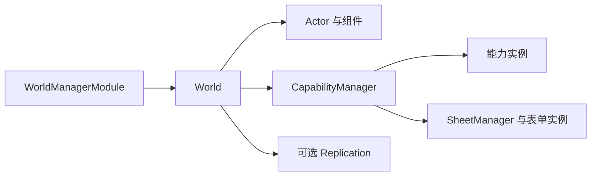

# ACC

ACC（Actor–Component–Capability）把实体、数据和行为分开。框架只提供存储、调度、表单和复制基础设施；组件与能力由项目定义。

## 概念

| 类型 | 作用 |
| --- | --- |
| `Actor` | 带版本的实体句柄，避免槽位复用后的旧引用误命中 |
| `IComponent` | 存储在世界中的纯数据结构体 |
| `Capability` | 由世界创建、调度和释放的行为 |
| `CapabilitySheet` | 批量组合组件、能力和子表单 |
| `World` | 拥有实体、组件、能力和复制层 |



箭头表示所有权。模块卸载会释放世界；销毁 Actor 会清理其组件、能力和表单。表单只移除本次应用创建的资源。

## 最小用法

```csharp
using Verve;

public struct Motion : IComponent
{
    public float Position;
    public float Speed;
}

public sealed class Move : Capability
{
    protected override void OnSetup() => Require<Motion>();

    protected override void TickActive(in float deltaTime)
    {
        ref var motion = ref this.GetComponent<Motion>();
        motion.Position += motion.Speed * deltaTime;
    }
}
```

```csharp
var handle = Game.CreateModules();
handle.Modules.Install<WorldManagerModule>();
var worlds = handle.Modules.GetModule<IWorldManager>();
var world = worlds.Create("Game");
var actor = world.CreateActor();
world.AddComponent<Motion>(actor).Speed = 2f;
world.AddCapability<Move>(actor);
```

在启动时创建并保存 `handle`，退出时调用 `handle.Dispose()`。`WorldManagerModule` 自动驱动活跃世界；批量配置使用 `world.ApplySheet(actor, sheet)`。

## 更新边界

- 结构变更在世界所属线程执行；其他线程通过 `World.Enqueue` 提交。
- `OnSetup` 中声明 `Require<T>`、`Block<T>` 和 Tick 配置。
- 能力条件、生命周期和 Tick 在世界线程按阶段、顺序、注册次序执行。
- 重计算可交给 Jobs/Burst 或独立任务，使用独立数据，完成后通过 `World.Enqueue` 提交；组件引用不能跨结构变更或释放保存。

## 可选复制

创建世界时传入 `ReplicationOptions`，用 `ReplicationSchema.Register<T>(id)` 登记需要同步的组件，并为要发布的 Actor 添加 `Replicated`。Schema 首次使用后冻结；两端必须使用相同的稳定 ID 和编码格式。特殊格式实现 `IReplicationCodec<T>`，可见性实现 `IReplicationInterest`。


调用 `world.Replication.Attach(transport)` 接入可信、可靠、有序且保留帧边界的传输；成功后由复制层独占并释放。框架自动处理背压，接收校验或解码失败不会提交部分状态。可选 QUIC/TLS 接入见 [ACCNet](../../Server~/ACCNet/README.md)。

## 编辑器入口

| 入口 | 用途 |
| --- | --- |
| `Verve/Capability Sheet` | 创建和编辑表单资产 |
| `Verve/ACC/时间记录器` | Play Mode 中按时间轴查看能力激活、停用、移除和异常事件 |
| `Verve/ACC/能力表单资源` | 搜索、选择和定位项目内 `CapabilitySheetAsset` |
| `Verve/ACC/校验全部能力表单` | 校验表单引用、类型和循环依赖 |
| `Project Settings > Verve > Modules > ACC > Tag Registry` | 维护标签及稳定 ID |
| 运行时 `World` 调试页 | 查看世界、Actor 和能力状态 |

## 验证

在 Unity Test Runner 的 PlayMode 中运行 [ACC 测试](../../Tests/Runtime/ACC)；性能比较见 [基准说明](../../Tests/Runtime/ACC/Benchmarks/README.md)。
