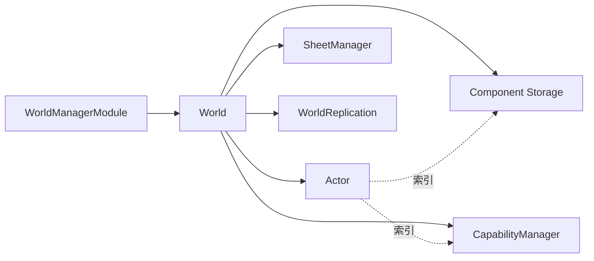

# ACC

> ACC（Actor-Component-Capability）把实体、数据和行为分开管理。`World` 拥有运行时对象，组件保存数据，能力执行行为，项目负责定义具体类型。

## 公共入口

| 类型 | 责任 | 所有者 |
| --- | --- | --- |
| `WorldManagerModule` / `IWorldManager` | 创建、切换、Tick 和销毁世界 | 模块容器 |
| `World` | 管理实体、组件、能力、能力表和可选复制 | `IWorldManager` |
| `Actor` | 带版本的实体句柄 | `World` |
| `IComponent` | 纯数据结构，必须是值类型 | `World` / 组件存储 |
| `Capability` | 面向实体的行为和 Tick | `World` |
| `CapabilitySheet` | 批量组合组件和能力 | `World.Sheets` |
| `WorldReplication` | 按复制配置同步组件状态 | `World` |



## 最小用法

```csharp
public struct Motion : IComponent
{
    public float Position;
    public float Speed;
}

using var handle = Game.CreateModules();
handle.Modules.Install<WorldManagerModule>();

var worlds = handle.Modules.GetModule<IWorldManager>();
var world = worlds.Create("Game");
var actor = world.CreateActor();
world.AddComponent<Motion>(actor).Speed = 2f;
```

## 复制边界

| 配置或接口 | 作用 |
| --- | --- |
| `ReplicationOptions` | 创建世界时固定角色、预算和可见性策略 |
| `ReplicationSchema.Register<T>` | 为组件登记稳定协议 ID |
| `IReplicationCodec<T>` | 自定义组件编码和解码 |
| `IReplicationInterest` | 按连接筛选可见实体 |
| `IReplicationTransport` | 接入可靠、有序且保持帧边界的传输 |


> **注意** 销毁 `Actor` 会清理其组件、能力和能力表；释放 `WorldManagerModule` 会释放全部世界。复制 Schema 首次使用后冻结，两端必须使用相同的稳定 ID 和编码格式。