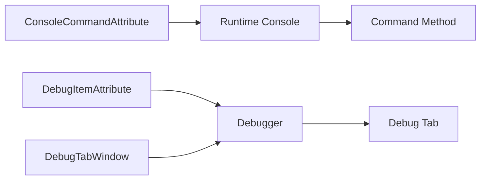

# Debug

> `Debug` 提供 Unity 运行时控制台和可扩展调试页，服务于开发、测试和问题定位，不承载业务状态。

## 公共入口

| 场景 | 入口 | 作用 |
| --- | --- | --- |
| 控制台开关 | `Game.DebugConsoleEnabled`、`Game.DebugConsoleToggleKey` | 启用控制台并设置切换按键 |
| 控制台命令 | `ConsoleCommandAttribute` | 将静态方法注册为命令 |
| 调试页 | `DebugItemAttribute`、`DebugTabWindow` | 注册页签并实现显示和绘制 |
| 主线程 | `Game.IsMainThread` | 判断 Unity 调试操作是否在主线程 |



## 最小命令

```csharp
[ConsoleCommand("reload_config", "重新加载配置")]
private static void ReloadConfig()
{
    // 仅执行调试操作；业务状态仍由对应模块拥有。
}
```