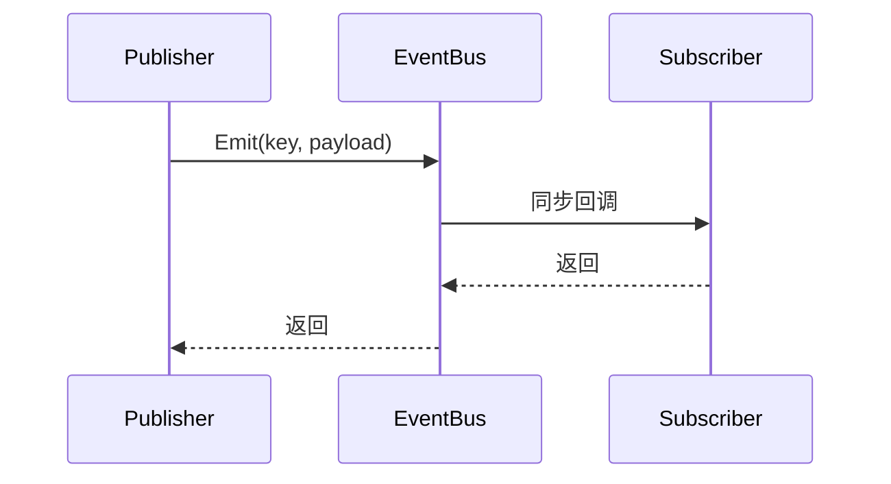

# EventBus

> 事件总线按字符串或整数键提供类型化同步发布订阅，适合低耦合通知；已有明确依赖的对象仍应直接调用。

## 公共入口

| 场景 | API | 所有权与行为 |
| --- | --- | --- |
| 无主订阅 | `Game.On<T>(key, handler)` | 调用方保存并 `Dispose` 返回句柄 |
| owner 订阅 | `Game.On<T>(key, handler, owner)` | `owner` 为 `MonoBehaviour`，销毁时自动取消 |
| 发布 | `Game.Emit<T>(key, value)` | 在调用线程同步执行回调 |
| 移除单项 | `Game.Off<T>(key, handler)` | 只移除指定回调 |
| 清空事件键 | `Game.Off(key)` | 移除该键的全部回调 |



## 最小用法

```csharp
private IDisposable m_Subscription;

private void OnEnable() =>
    m_Subscription = Game.On<int>("PlayerDamaged", OnDamaged);

private void OnDisable() => m_Subscription.Dispose();

private void OnDamaged(int amount) { }
```