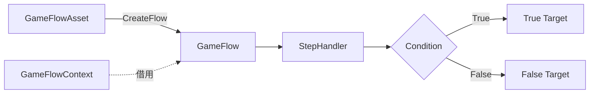
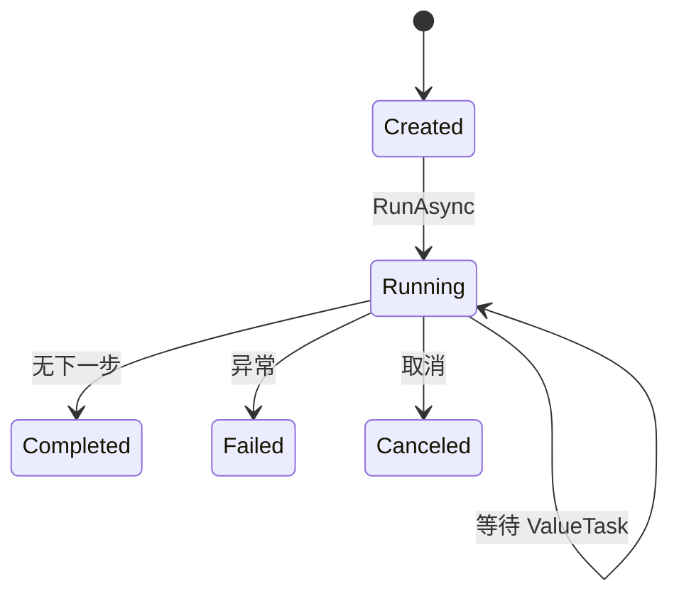

# GameFlow

> `GameFlow` 将异步步骤、进度和条件分支组成一次性运行流程，适合初始化、检查更新、下载更新和进入游戏等顺序明确的场景。

## 公共入口

| 类型 | 责任 |
| --- | --- |
| `GameFlowAsset` | 保存步骤、条件、连接和编辑器布局，并创建运行时流程 |
| `GameFlow` | 按顺序或显式转换执行步骤，公开状态和进度 |
| `GameFlowStepHandler` | 实现步骤的进入、异步执行和离开生命周期 |
| `GameFlowCondition` | 步骤完成后计算 True/False 分支 |
| `GameFlowContext` | 向步骤提供模块容器和业务数据引用 |

## 执行关系



## 状态和规则

| 状态或规则 | 行为 |
| --- | --- |
| `Created` | 尚未执行，仍可添加步骤和转换 |
| `Running` | 等待当前步骤的 `ValueTask` 完成 |
| `Completed` | 当前路径没有下一步 |
| `Failed` | 步骤、条件或转换抛出异常 |
| `Canceled` | 取消令牌触发取消 |
| 无显式转换 | 按资产中启用步骤的顺序执行 |
| 显式转换无目标 | 当前分支结束 |
| 无效目标或缺少处理器 | `CreateFlow` 直接抛出异常 |



## 最小步骤

```csharp
[Serializable]
[GameFlowDisplayName("检查版本")]
public sealed class CheckVersionHandler : GameFlowStepHandler
{
    public override async ValueTask ExecuteAsync(
        GameFlowContext context, CancellationToken ct, Action<float> reportProgress)
    {
        await CheckAsync(context, ct);
        reportProgress(1f);
    }
}
```

```csharp
var flow = asset.CreateFlow(new GameFlowContext(modules, userData));
await flow.RunAsync(ct: ct);
```