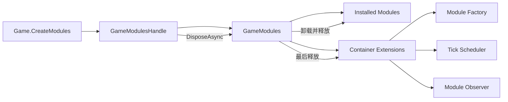
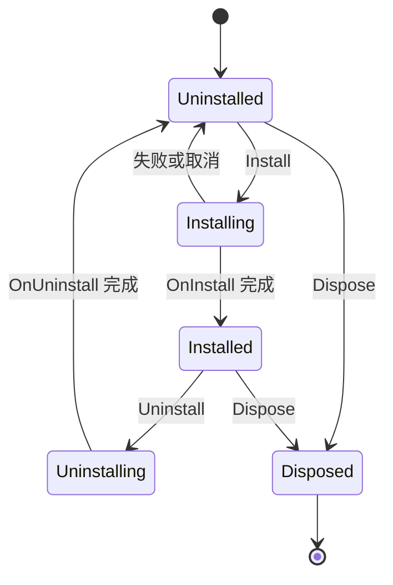

# Modules

> 模块容器负责安装顺序、依赖解析、Tick 登记、观察通知和释放。模块拥有自己的资源，容器拥有模块及其生命周期扩展。

## 公共入口

| 场景 | 入口 | 作用 |
| --- | --- | --- |
| 创建容器 | `Game.CreateModules`、`GameModulesHandle` | 创建并显式持有一组模块 |
| 声明模块 | `GameModule`、`GameModuleDependencyAttribute` | 定义模块生命周期和依赖 |
| 组合安装 | `GameModuleManifest` | 按依赖或声明顺序安装模块 |
| 模块上下文 | `GameModuleContext` | 查询已声明依赖、登记和移除 Tick |
| 容器扩展 | `GameModulesOptions` | 配置工厂、调度器和观察者 |
| 释放容器 | `GameModulesHandle.DisposeAsync` | 先释放模块，再释放容器扩展 |

## 所有权



## 生命周期



## 最小用法

```csharp
[Serializable]
public sealed class GameplayModule : GameModule
{
}

var manifest = new GameModuleManifest();
manifest.Add<GameplayModule>();

var handle = Game.CreateModules(manifest);
await handle.DisposeAsync();
```