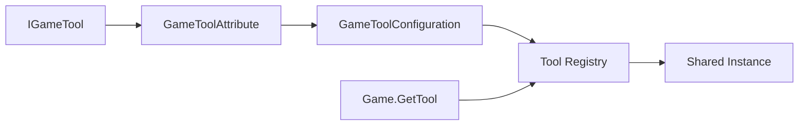

# Tools

> Tools 是无状态能力层。业务依赖接口，项目通过配置选择实现；需要安装、卸载或持有资源的能力应使用 `GameModule`。

## 公共契约

| 类型或 API | 作用 |
| --- | --- |
| `IGameTool` | 工具能力接口的标记基类 |
| `GameToolAttribute` | 为接口声明展示名和可选默认实现 |
| `GameToolConfiguration` | 保存接口到项目实现的映射 |
| `Game.ConfigureTools` | 非 Unity 宿主在首次访问前固定配置 |
| `Game.GetTool<T>` | 获取按接口缓存的共享实例 |



## 自定义工具

```csharp
[GameTool("项目编码")]
public interface IProjectCodec : IGameTool
{
    byte[] Encode(ReadOnlySpan<byte> value);
}

var configuration = new GameToolConfiguration()
    .Set<IProjectCodec, ProjectCodec>();
Game.ConfigureTools(configuration);

var codec = Game.GetTool<IProjectCodec>();
```