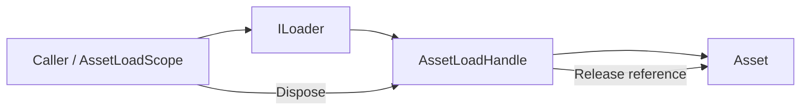

# Loader

> Loader 以 Unity 项目路径统一访问资源和场景，隐藏 Addressables、AssetBundle 等实现差异，并把引用释放交给句柄或作用域。

## 公共入口

| 场景 | 入口 | 所有权 |
| --- | --- | --- |
| 资源加载 | `ILoader.LoadAsset`、`LoadAssetAsync` | 返回 `AssetLoadHandle<T>`，调用方负责释放 |
| 场景加载 | `ILoader.LoadSceneAsync`、`UnloadSceneAsync` | 通过 `SceneLoadHandle` 控制激活和卸载 |
| 批量托管 | `AssetLoadScope` | 作用域接管句柄并统一释放 |
| 模块选择 | `LoaderModule.LoaderMode`、`AssetLoaderMode` | 安装前选择 Addressables 或 AssetBundle |



## 最小用法

```csharp
var loader = modules.Modules.GetModule<ILoader>();
using var scope = new AssetLoadScope();

var icon = scope.Track(
    await loader.LoadAssetAsync<Sprite>("Assets/UI/Icons/Close.png", ct));
```