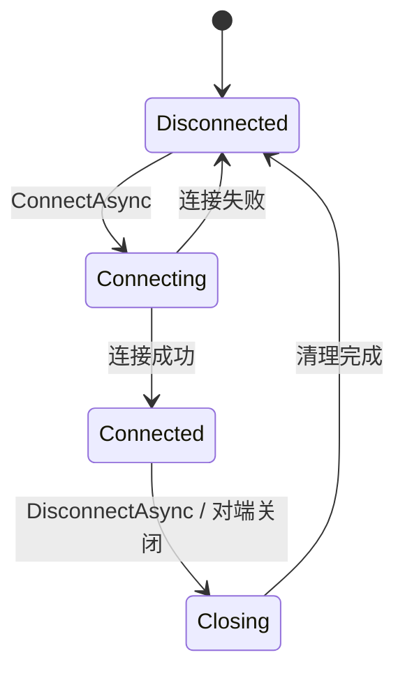

# Network

> Network 是可选网络模块，管理 WebSocket 连接、收发和释放；它不保存游戏业务状态，业务协议由上层定义。

## 公共入口

| 场景 | 入口 | 边界 |
| --- | --- | --- |
| 网络模块 | `NetworkModule` | 由 `GameModules` 安装和释放 |
| 连接状态 | `NetworkModule.State` | 由模块维护，只读查询 |
| 连接 | `NetworkModule.ConnectAsync` | 仅接受 `ws` 或 `wss` URI |
| 文本收发 | `SendTextAsync`、`ReceiveTextAsync` | 单条消息受 `MaxReceiveMessageBytes` 限制 |
| 断开 | `DisconnectAsync` | 由模块关闭连接并清理并发操作 |



```csharp
var network = modules.Modules.GetModule<NetworkModule>();
await network.ConnectAsync(new Uri("wss://example.test/socket"), ct);
await network.SendTextAsync("ping", ct);
var message = await network.ReceiveTextAsync(ct);
await network.DisconnectAsync(ct);
```