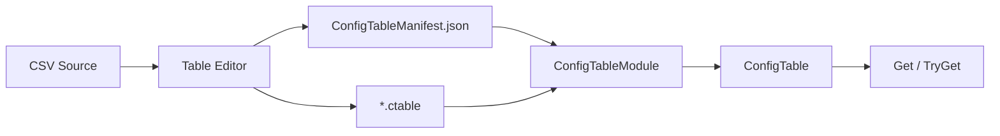

# Table

> Table 在安装阶段加载 `StreamingAssets/Tables` 中的配置表，构建只读索引，并提供字符串或整数 ID 查询。

## 公共入口

| 场景 | 入口 | 说明 |
| --- | --- | --- |
| 安装模块 | `ConfigTableModule`、`IConfigTables` | 加载清单、分表和来源元数据 |
| 获取表 | `IConfigTables.Get` | 返回已加载的 `ConfigTable` |
| 查询记录 | `ConfigTable.Get`、`ConfigTable.TryGet` | 按字符串或整数 ID O(1) 查询 |
| 读取字段 | `ConfigTableRow.GetString`、`GetInt`、`GetFloat` 等 | 按字段名或字段索引读取并校验类型 |
| 重载数据 | `IConfigTables.ReloadAsync` | 原表和生成行缓存失效，调用方重新获取引用 |
| 编辑器生成 | Table Editor | 从 CSV 构建 `.ctable`、清单和类型化访问器 |

