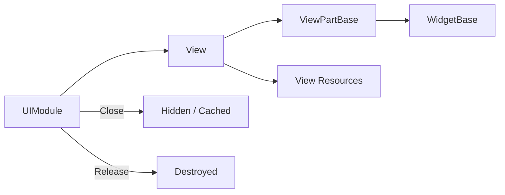
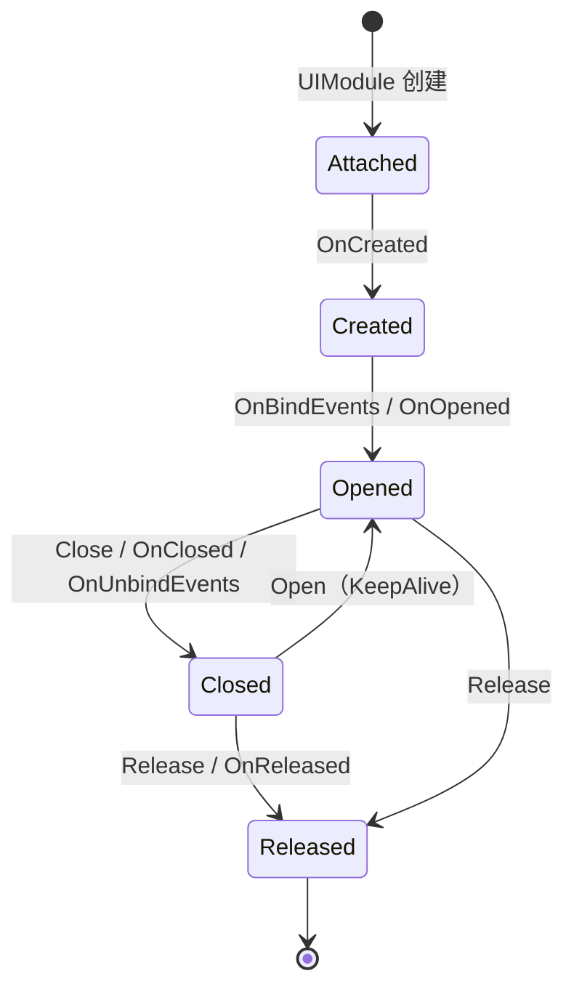

# UI

> UI 模块管理 View、ViewPart 和 Widget 的创建、打开、关闭、缓存与释放；页面及其子对象只由所属管理者创建和销毁。

## 核心功能

| 类型 | 责任 | 所有者 |
| --- | --- | --- |
| `UIModule` / `IUIManager` | 页面打开、关闭、释放和查询 | `UIModule` |
| `ViewBase` | 页面状态和生命周期 | `UIModule` |
| `ViewPartBase` | 页面子树和动态对象 | `ViewBase` |
| `WidgetBase` | 可复用数据单元 | `ViewBase` 或 `ViewPartBase` |
| `ViewStack` / `UIModalLayer` | 返回栈和模态遮罩 | `UIModule` |



## 生命周期



`ViewPartBase` 和 `WidgetBase` 跟随所属对象创建和释放；页面缓存只保留实例，不会改变所有权。

```csharp
var ui = modules.Modules.GetModule<IUIManager>();
var login = ui.Open<LoginView>();
ui.Close(login);
ui.Release(login);
```