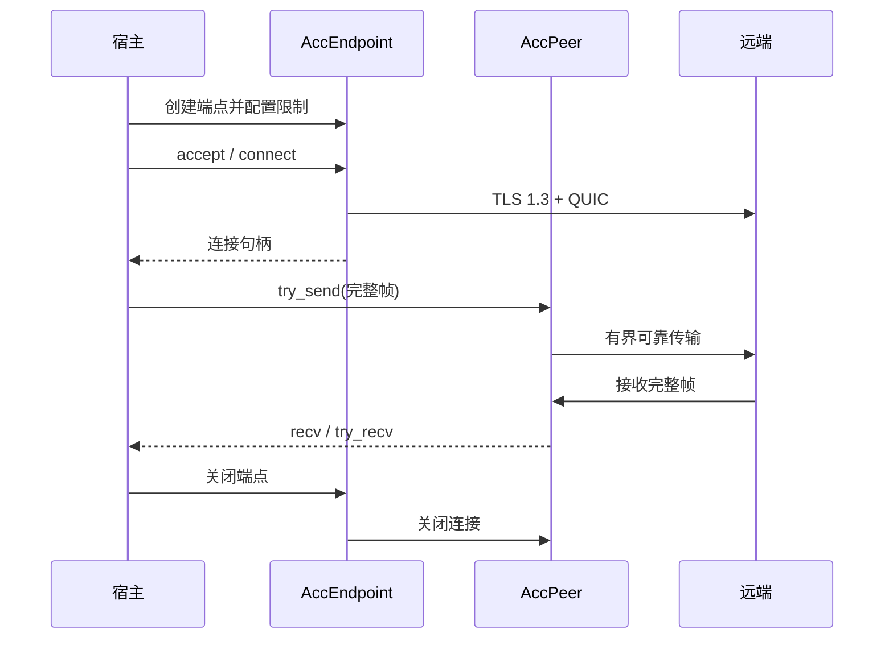
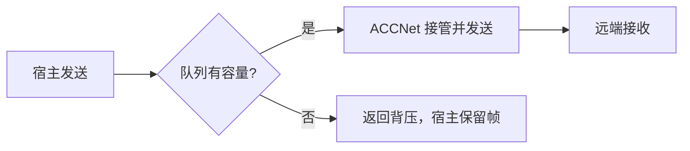

# ACCNet

ACCNet 是可嵌入的 Rust 网络接入层，提供 QUIC、TLS 1.3、可靠帧和有界队列。宿主负责账号、授权、房间和路由；ACCNet 不持有游戏业务状态。

## 接入

| 宿主 | 入口 |
| --- | --- |
| Rust | `AccEndpoint`、`AccPeer`；[最小宿主](examples/host.rs) |
| C / C++ | [C ABI 头文件](include/verve_acc_net.h) |
| C# | [P/Invoke 绑定](bindings/csharp/AccEndpoint.cs) |
| Java | [Java 绑定](bindings/java/AccEndpoint.java)、[JNI 桥接](bindings/java/acc_jni.cpp) |
| Go | [cgo 绑定](bindings/go/accnet.go) |



Rust 的 `AccEndpoint` 释放时关闭全部连接，宿主持有的 `AccPeer` 在释放时取消后台任务。C ABI 端点拥有全部子句柄，释放端点即可完成清理。

## 配置与扩展

使用 `Limits::load` 读取 [accnet.toml](accnet.toml)，或直接传入 `Limits`。`reload(path)` 仅支持修改 `frames_per_second` 和 `bytes_per_second`；其他设置需新建端点。重载失败保留旧配置，库不自动监视文件。

宿主可以在 Rust API 中提供自定义 `PacketValidator`；C ABI 使用固定的 ACC v2 校验流程。业务协议和组件编码由宿主与 ACC 负责。

## 收发边界



发送成功表示网络层接管，断线后仍需重新同步；队列满时重试，不能丢弃状态增量。C ABI 仅在调用期间借用输入指针，接收缓冲区不足时报告所需大小并保留帧。

默认启用证书校验、ALPN `verve-acc/2`、帧长/队列/连接数/速率上限；协议违规关闭当前连接并返回错误。

## 构建与验证

需要 Rust 1.87 或更高版本：

```bash
cargo build --release
cargo test --all-targets
cargo clippy --all-targets -- -D warnings
```

QUIC、重载、背压和跨语言回归测试位于 [tests](tests/)。
